# Digital Cinema Package (DCP)

Package DCP standard format files for digital projection.

## Software

* [DCP-o-matic](https://dcpomatic.com/get-started.php)
  * Windows, Mac, and Linux
  * Create DCP files from source material in other formats

* [MakeMKV](https://www.makemkv.com/)
  * Windows and Mac
  * Retrieve media stored on disc formats like DVD and Blu-ray

* [BD3D2MK3D](https://download.videohelp.com/r0lZ/BD3D2AVS/#current)
  * **\*Windows-only\***
  * Convert MVC stereo 3D video content to other formats

## Use MakeMKV to create a bit-perfect source .MKV file from a disc

1. [Download](https://www.makemkv.com/download/) and install MakeMKV

2. Activate with your key
    * Use the [beta key](https://forum.makemkv.com/forum/viewtopic.php?t=1053) if you need to test before you purchase

4. Create an MKV file from the source disc
    * **Make sure to select the stereo video track if the movie is 3D!**
    * Select the audio track(s) you need, usually just one
    * Don't include captions unless you need to burn in the `Forced` subtitles

## 3D

Convert stereoscopic 3D content encoded in MVC (used by the 3D Blu-ray format) to DCP.

### Use BD3D2MK3D to create an intermediate file

#### Install AviSynth+:

* https://github.com/pinterf/AviSynthPlus/releases
  * I used this, but it seems like it’s older
* https://github.com/AviSynth/AviSynthPlus/releases
  * Looks actively-maintained

#### Install BD3D2MK3D:

* https://download.videohelp.com/r0lZ/BD3D2AVS/#current

Once installed, run BD3D2MK3D.

1. Drag and drop an MKV file created with MakeMKV to select the source file (or switch from `Blu-ray 3D mode` to `3D MKV mode` and browse for one):

   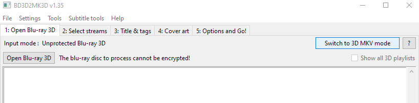

   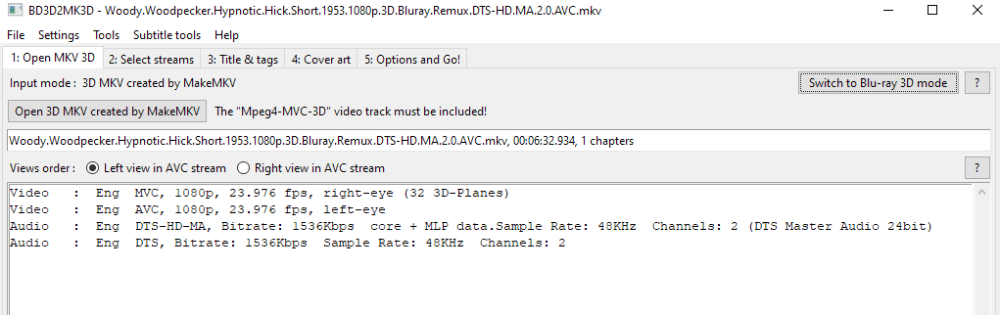

2. Typically, select only the main audio stream and no subtitles:

   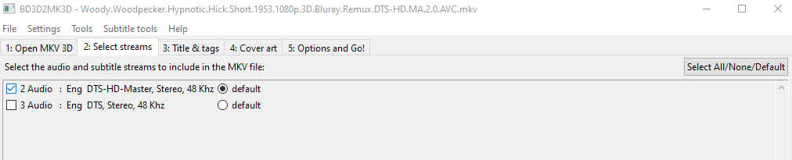

3. Name the movie:

   

4. Configure the `AviSynth` script in the `Options` tab:
    * For `Stereoscopy`, use `Side By Side` (`Half` should be unchecked to enable full-res output)
    * For `x264`, use `CRF` around `15` to preserve as much visual quality as possible
      * Lower the CRF or experiment with bitrate-based compression modes if the output quality is not sufficient
      * Remember, the final output will be blown up on a huge screen, so preserve as much input quality as possible!
      * The output is temporary since it will be compressed one more time, so file size at this stage is not important
    * Define a valid temp directory
      * Needs to be a full/non-relative path
      * Can require >3x the space of the original file to complete operation
    * `mux to MKV file` checked

      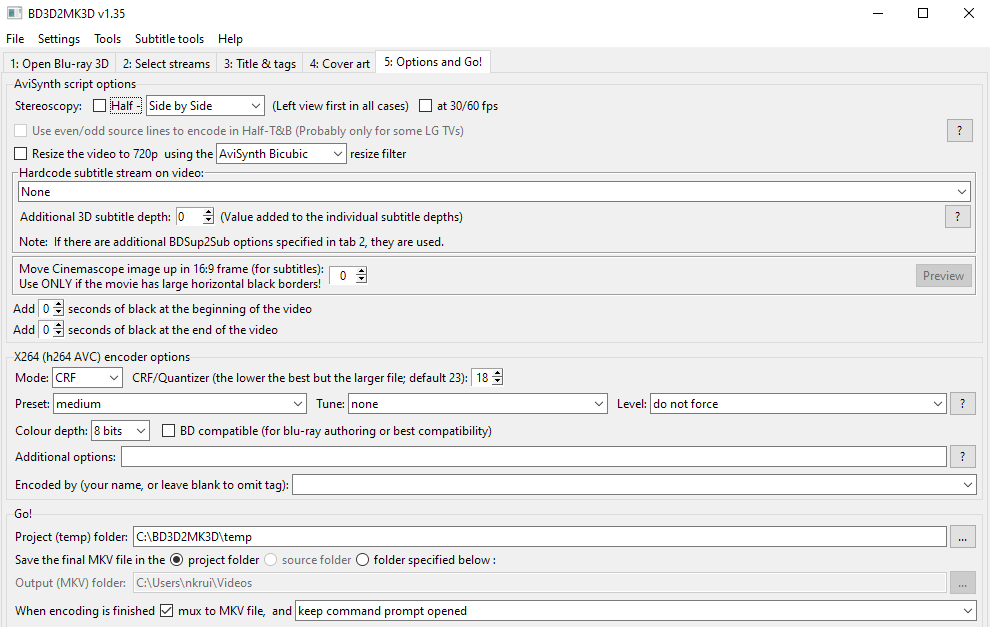

5. Run the generated script to encode: `__ENCODE_3D_LAUNCHER.cmd`

   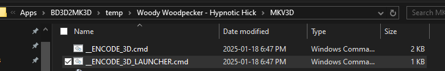

   This ran at approximately 50fps on an 8-core cpu, thus taking about half the film’s runtime to finish.

### Use DCP-o-matic to encode a 3D source into a DCP

1. [Download](https://dcpomatic.com/download) and install DCP-o-matic.

2. Create a new project (choose the directory carefully as the result can require >3x the size of the source file)

3. Make sure to set to `3D left/right`:

   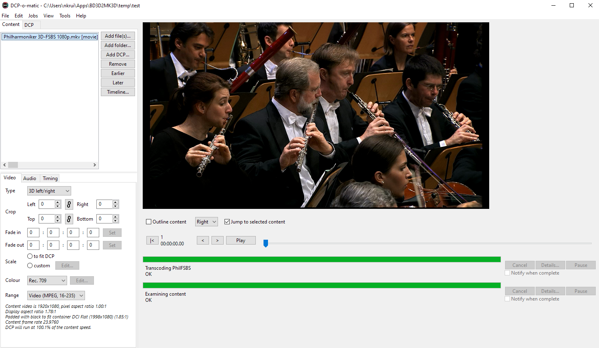

4. Scope usually requires additional adjustments to achieve an optimal fit, but be sure to check both eyes when working in 3D to avoid over-cropping:

   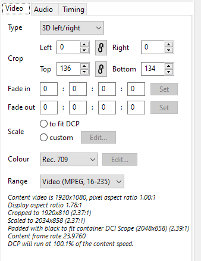

5. Then go to the DCP settings and configure them accordingly.

   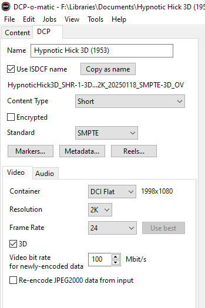

   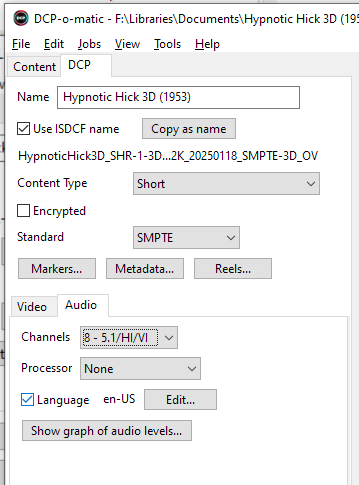

   **IMPORTANT NOTE:** Although the default 8-channel mapping works fine for standard 5.1 sources like DTS, care must be taken with 7.1 sources to ensure that the additional surround channels are not mapped to incorrect streams like HI/VI - output in 16-channel mode and then map them correctly like this example using DTS-HD MA 7.1:

   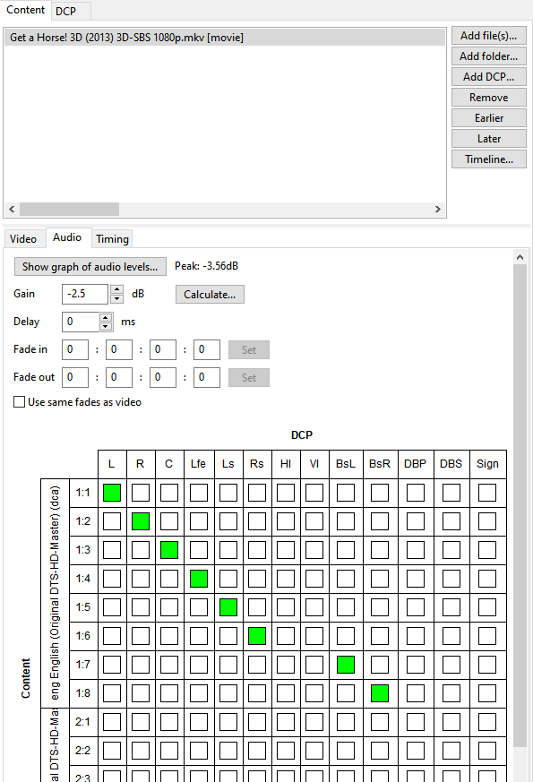

6. Pack into a DCP:

   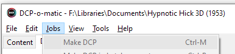

   This is processor intensive and ran at approximately 25fps, thus taking about as long as the film’s runtime to finish.

7. Examine the result. It should have extra padding on the sides as necessary to ensure it will properly fit in the theatrical 1.85 Flat container (or 2.39 Scope container) instead of the 1.78 aspect ratio of Blu-ray. In the DCP, the configuration [should be as-expected for 3D](https://en.easydcp.com/support-faq.php?id=24&p=which-aspect-ratio-should-i-choose-for-my-dcp).

   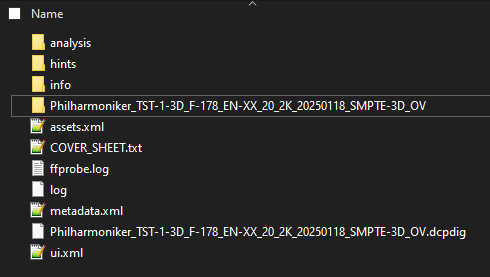

   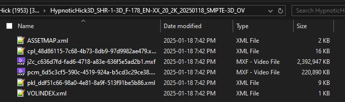

   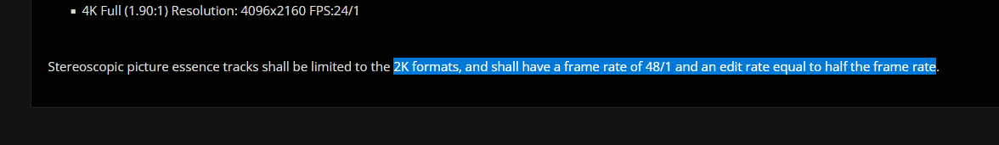

   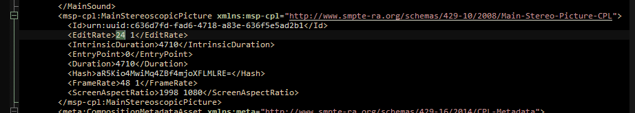
