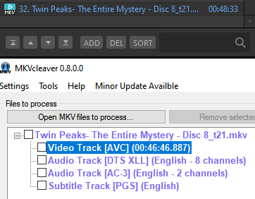
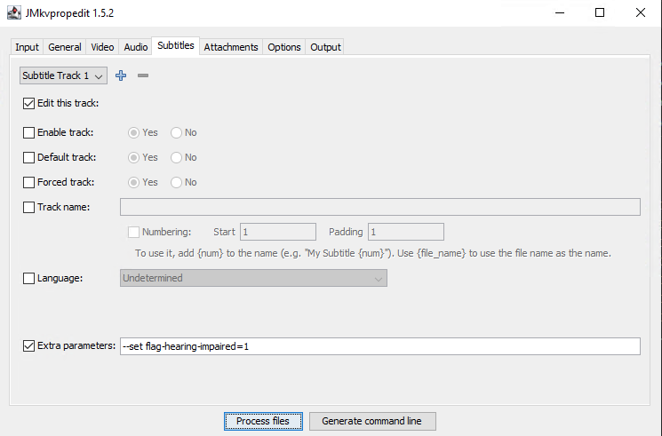

# MKV

Notes about working with Matroska Video (`.mkv`) files.

## All-purpose MKV tool

Use `MKVToolNix`.

https://codeberg.org/mbunkus/mkvtoolnix (formerly at https://gitlab.com/mbunkus/mkvtoolnix)

https://mkvtoolnix.download/downloads.html

Install with `winget` on Windows as `MoritzBunkus.MKVToolNix`.

https://github.com/microsoft/winget-pkgs/tree/master/manifests/m/MoritzBunkus/MKVToolNix

## Extracting tracks from MKVs

Use `mkvcleaver` (requires MKVToolNix).

https://blogs.sapib.ca/apps/mkvcleaver/

https://www.videohelp.com/software/MKVcleaver

## Inspecting MKVs

All the general tools are useful for this but sometimes there are shortcuts.

### If an MKV stops playing before the end of the runtime, how to identify the real video length?

Easiest way is to use MKVcleaver; it will display the runtime of the video in the UI immediately on import.

## Remuxing MKVs

Rewriting MKV files into new, modified versions without re-encoding the original tracks (remuxing) can be done with MKVToolNix. It can also convert files from other container formats into MKV.

### Appending files vs. adding as additional parts

In MKVToolNix, files can be combined to run one after another, if they are similar enough:

https://codeberg.org/mbunkus/mkvtoolnix/wiki/Adding-files-vs.-Appending-files-vs.-adding-as-additional-parts#appending-files-vs-adding-as-additional-parts

**TL;DR from the official doc:**

* Media files split somewhere in the middle at an arbitrary position so that the second part doesn't have a full set of headers ➡ choose `Add as additional parts`
  * DVDs use this method, for example the `VTS_01_1.VOB`/`VTS_01_2.VOB` files are all logically part of one huge file.
* For most cases, files contain full sets of headers ➡ choose `Append`
  * Blu-ray `.m2ts` files can have different internal stream/track IDs for the same logical video track, so the best option is to add `.mpls` playlist files instead

## Editing MKVs

In-place modification of MKV files requires MKVToolNix. The files can then be edited with `MKVToolNix GUI` in the `editor` tab menus, with `mkvpropedit` via CLI, or with the `jmkvpropedit` GUI.

### Flags

Flags can be set on tracks to identify if they are SDH/commentary etc.

https://old.reddit.com/r/mkvtoolnix/comments/128aqb3/how_to_set_matroska_track_flags_using_mkvpropedit/

https://gitlab.com/mbunkus/mkvtoolnix/-/issues/3011

https://github.com/ietf-wg-cellar/matroska-specification/blob/master/ebml_matroska.xml

#### Some useful flags:

* `flag-hearing-impaired=1`
* `flag-commentary=1`

#### Example command to set `FlagHearingImpaired` on the first subtitle track of a file:

`"C:\Program Files\MKVToolNix\mkvpropedit.exe" "X:\file.mkv" --edit track:s1 --set flag-hearing-impaired=1`

#### Equivalent action in `jmkvpropedit` GUI

### List Properties

Output of command `mkvpropedit --list-property-names` for `v88.0`:
    
    All known property names and their meaning
    
    Elements in the category 'Segment information' ('--edit info'):
    title               | US | Title: The title for the whole movie.
    date                | DT | Date: The date the file was created.
    segment-filename    | US | Segment filename: The file name for this segment.
    prev-filename       | US | Previous filename: An escaped filename corresponding
                        |    | to the previous segment.
    next-filename       | US | Next filename: An escaped filename corresponding to
                        |    | the next segment.
    segment-uid         | X  | Segment unique ID: A randomly generated unique ID to
                        |    | identify the current segment between many others
                        |    | (128 bits).
    prev-uid            | X  | Previous segment's unique ID: A unique ID to
                        |    | identify the previous chained segment (128 bits).
    next-uid            | X  | Next segment's unique ID: A unique ID to identify
                        |    | the next chained segment (128 bits).
    muxing-application  | US | Multiplexing application: The name of the
                        |    | application or library used for multiplexing the
                        |    | file.
    writing-application | US | Writing application: The name of the application or
                        |    | library used for writing the file.
    
    Elements in the category 'Track headers' ('--edit track:...'):
    track-number                     | UI | Track number: The track number as used
                                     |    | in the Block Header.
    track-uid                        | UI | Track UID: A unique ID to identify the
                                     |    | Track. This should be kept the same
                                     |    | when making a direct stream copy of the
                                     |    | Track to another file.
    flag-commentary                  | B  | "Commentary" flag: Can be set if the
                                     |    | track contains commentary.
    flag-default                     | B  | "Default track" flag: Set if that track
                                     |    | (audio, video or subs) SHOULD be used
                                     |    | if no language found matches the user
                                     |    | preference.
    flag-enabled                     | B  | "Track enabled" flag: Set if the track
                                     |    | is used.
    flag-forced                      | B  | "Forced display" flag: Can be set for
                                     |    | tracks containing onscreen text or
                                     |    | foreign-language dialog.
    flag-hearing-impaired            | B  | "Hearing impaired" flag: Can be set if
                                     |    | the track is suitable for users with
                                     |    | hearing impairments.
    flag-original                    | B  | "Original language" flag: Can be set if
                                     |    | the track is in the content's original
                                     |    | language (not a translation).
    flag-text-descriptions           | B  | "Text descriptions" flag: Can be set if
                                     |    | the track contains textual descriptions
                                     |    | of video content suitable for playback
                                     |    | via a text-to-speech system for a
                                     |    | visually-impaired user.
    flag-visual-impaired             | B  | "Visual impaired" flag: Can be set if
                                     |    | the track is suitable for users with
                                     |    | visual impairments.
    default-duration                 | UI | Default duration: Number of nanoseconds
                                     |    | (not scaled) per frame.
    name                             | US | Name: A human-readable track name.
    language                         | S  | Language (obsolete): Specifies the
                                     |    | language of the track (obsolete).
    language-ietf                    | S  | Language: Specifies the language of the
                                     |    | track in the form of a BCP 47 language
                                     |    | tag.
    codec-id                         | S  | Codec ID: An ID corresponding to the
                                     |    | codec.
    codec-name                       | US | Codec name: A human-readable string
                                     |    | specifying the codec.
    codec-delay                      | UI | Codec-inherent delay: Delay built into
                                     |    | the codec during decoding in ns.
    alpha-mode                       | B  | Video alpha mode: Set if the
                                     |    | BlockAdditional element with BlockAddID
                                     |    | of '1' contains alpha channel data.
    interlaced                       | UI | Video interlaced flag: Set if the video
                                     |    | is interlaced.
    pixel-width                      | UI | Video pixel width: Width of the encoded
                                     |    | video frames in pixels.
    pixel-height                     | UI | Video pixel height: Height of the
                                     |    | encoded video frames in pixels.
    display-width                    | UI | Video display width: Width of the video
                                     |    | frames to display.
    display-height                   | UI | Video display height: Height of the
                                     |    | video frames to display.
    display-unit                     | UI | Video display unit: Type of the unit
                                     |    | for DisplayWidth/Height (0: pixels, 1:
                                     |    | centimeters, 2: inches, 3: aspect
                                     |    | ratio).
    pixel-crop-left                  | UI | Video crop left: The number of video
                                     |    | pixels to remove on the left of the
                                     |    | image.
    pixel-crop-top                   | UI | Video crop top: The number of video
                                     |    | pixels to remove on the top of the
                                     |    | image.
    pixel-crop-right                 | UI | Video crop right: The number of video
                                     |    | pixels to remove on the right of the
                                     |    | image.
    pixel-crop-bottom                | UI | Video crop bottom: The number of video
                                     |    | pixels to remove on the bottom of the
                                     |    | image.
    aspect-ratio-type                | UI | Video aspect ratio type: Specify the
                                     |    | possible modifications to the aspect
                                     |    | ratio (0: free resizing, 1: keep aspect
                                     |    | ratio, 2: fixed).
    field-order                      | UI | Video field order: Field order (0, 1,
                                     |    | 2, 6, 9 or 14, see documentation).
    stereo-mode                      | UI | Video stereo mode: Stereo-3D video mode
                                     |    | (0 - 14, see documentation).
    color-matrix-coefficients        | UI | Video: color matrix coefficients: Sets
                                     |    | the matrix coefficients of the video
                                     |    | used to derive luma and chroma values
                                     |    | from red, green and blue color
                                     |    | primaries.
    color-bits-per-channel           | UI | Video: bits per color channel: Sets the
                                     |    | number of coded bits for a color
                                     |    | channel.
    chroma-subsample-horizontal      | UI | Video: horizontal chroma subsampling:
                                     |    | The amount of pixels to remove in the
                                     |    | Cr and Cb channels for every pixel not
                                     |    | removed horizontally.
    chroma-subsample-vertical        | UI | Video: vertical chroma subsampling: The
                                     |    | amount of pixels to remove in the Cr
                                     |    | and Cb channels for every pixel not
                                     |    | removed vertically.
    cb-subsample-horizontal          | UI | Video: horizontal Cb subsampling: The
                                     |    | amount of pixels to remove in the Cb
                                     |    | channel for every pixel not removed
                                     |    | horizontally. This is additive with
                                     |    | chroma-subsample-horizontal.
    cb-subsample-vertical            | UI | Video: vertical Cb subsampling: The
                                     |    | amount of pixels to remove in the Cb
                                     |    | channel for every pixel not removed
                                     |    | vertically. This is additive with
                                     |    | chroma-subsample-vertical.
    chroma-siting-horizontal         | UI | Video: horizontal chroma siting: How
                                     |    | chroma is sited horizontally.
    chroma-siting-vertical           | UI | Video: vertical chroma siting: How
                                     |    | chroma is sited vertically.
    color-range                      | UI | Video: color range: Clipping of the
                                     |    | color ranges.
    color-transfer-characteristics   | UI | Video: transfer characteristics: The
                                     |    | color transfer characteristics of the
                                     |    | video.
    color-primaries                  | UI | Video: color primaries: The color
                                     |    | primaries of the video.
    max-content-light                | UI | Video: maximum content light: Maximum
                                     |    | brightness of a single pixel in
                                     |    | candelas per square meter (cd/m²).
    max-frame-light                  | UI | Video: maximum frame light: Maximum
                                     |    | frame-average light level in candelas
                                     |    | per square meter (cd/m²).
    chromaticity-coordinates-red-x   | FP | Video: chromaticity red X: Red X
                                     |    | chromaticity coordinate as defined by
                                     |    | CIE 1931.
    chromaticity-coordinates-red-y   | FP | Video: chromaticity red Y: Red Y
                                     |    | chromaticity coordinate as defined by
                                     |    | CIE 1931.
    chromaticity-coordinates-green-x | FP | Video: chromaticity green X: Green X
                                     |    | chromaticity coordinate as defined by
                                     |    | CIE 1931.
    chromaticity-coordinates-green-y | FP | Video: chromaticity green Y: Green Y
                                     |    | chromaticity coordinate as defined by
                                     |    | CIE 1931.
    chromaticity-coordinates-blue-x  | FP | Video: chromaticity blue X: Blue X
                                     |    | chromaticity coordinate as defined by
                                     |    | CIE 1931.
    chromaticity-coordinates-blue-y  | FP | Video: chromaticity blue Y: Blue Y
                                     |    | chromaticity coordinate as defined by
                                     |    | CIE 1931.
    white-coordinates-x              | FP | Video: white point X: White color
                                     |    | chromaticity coordinate X as defined by
                                     |    | CIE 1931.
    white-coordinates-y              | FP | Video: white point Y: White color
                                     |    | chromaticity coordinate Y as defined by
                                     |    | CIE 1931.
    max-luminance                    | FP | Video: maximum luminance: Maximum
                                     |    | luminance in candelas per square meter
                                     |    | (cd/m²).
    min-luminance                    | FP | Video: minimum luminance: Minimum
                                     |    | luminance in candelas per square meter
                                     |    | (cd/m²).
    projection-type                  | UI | Video: projection type: Describes the
                                     |    | projection used for this video track (0
                                     |    | – 3).
    projection-private               | X  | Video: projection-specific data:
                                     |    | Private data that only applies to a
                                     |    | specific projection.
    projection-pose-yaw              | FP | Video: projection's yaw rotation:
                                     |    | Specifies a yaw rotation to the
                                     |    | projection.
    projection-pose-pitch            | FP | Video: projection's pitch rotation:
                                     |    | Specifies a pitch rotation to the
                                     |    | projection.
    projection-pose-roll             | FP | Video: projection's roll rotation:
                                     |    | Specifies a roll rotation to the
                                     |    | projection.
    sampling-frequency               | FP | Audio sampling frequency: Sampling
                                     |    | frequency in Hz.
    output-sampling-frequency        | FP | Audio output sampling frequency: Real
                                     |    | output sampling frequency in Hz.
    channels                         | UI | Audio channels: Numbers of channels in
                                     |    | the track.
    bit-depth                        | UI | Audio bit depth: Bits per sample,
                                     |    | mostly used for PCM.
    emphasis                         | UI | Audio emphasis: Emphasis applied on
                                     |    | audio which must be reversed by player
                                     |    | to get the actual samples.
    
    Element types:
      SI: signed integer
      UI: unsigned integer
      B:  boolean (0 or 1)
      S:  string
      US: Unicode string
      X:  binary in hex
      FP: floating point number
      DT: date & time
