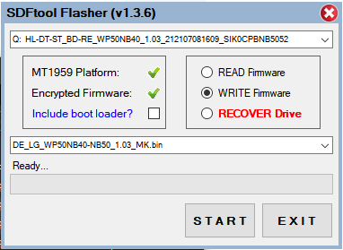
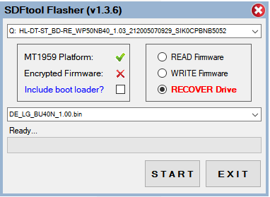

# Optical Disk Drive Firmware

It is possible to flash LG Blu-ray drives based on the Mediatek chipset in order to read 4K UHD Blu-ray discs in 'LibreDrive' mode. Pioneer drives are not supported at this time.

## Current availability

Hitachi-LG Data Storage (HLDS) slimline Blu-ray drives are still available on the market. These are commonly sold as `LG WP50NB40`, `HLDS BU40N`, `Buffalo PUS6U3B`, etc.

Those HLDS slimline drives are seemingly the only drive platform being actively manufactured for PC use. There does not appear to be active production of 5.25-inch SATA drives at this time.

## LG WP50NB40 NB52

The `LG WP50NB40` works over USB and remains available from large retailers at MSRP, making it a good choice at this point in time.

This is the cross-flashing process for `WP50NB40` (only models with SVC Code: `NB52`) on firmware `1.03` to `BU40N` firmware `1.00`, which unlocks LibreDrive capabilities for the drive:

1. Run `SDFtool Flasher.exe` from `SDFtool Flasher (v1.3.6).zip`, by `MartyMcNuts` from the [MakeMKV Forum](https://forum.makemkv.com/forum/viewtopic.php?t=22896). The package is mirrored here in case the the thread links are unavailable.

2. In the top dropdown, locate the drive like `X:  HL-DT-ST_BD-RE_WP50NB40_1.03_...` (unplugging all others can make this easier) and select it to confirm the available drive has ✔ listed for `Encrypted Firmware`.

3. Select the firmware dropdown, and a popup will open. Pick `DE_LG_WP50NB40-NB50_1.03_MK.bin` (mirrored here):

   

4. Select `START` to write the *DE*-crypted `MK` firmware to the drive.

5. When complete, it will de-select the drive and refresh the list. In the top dropdown, select the correct drive again and confirm that `Encrypted Firmware` is now listed as ❌.

4. Select `RECOVER Drive`, and a popup will open. Pick the same firmware flashed in the previous step, `DE_LG_WP50NB40-NB50_1.03_MK.bin`. The `RECOVER Drive` radio button should now be toggled.

5. Select the firmware selection dropdown box, and it will open a second popup. In there, select `DE_LG_BU40N_1.00.bin` (mirrored here):

   

6. Press `START` and the entire process will be done in around 30 seconds. Once complete, the drive should show up with an updated identifier string like `X:  HL-DT-ST_BD-RE_BU40N_1.00_...` which shows the new firmware and apparent model number.

7. Perform a power cycle by unplugging the drive and reconnecting it. If this is not done, MakeMKV can hang on first accessing the drive.
